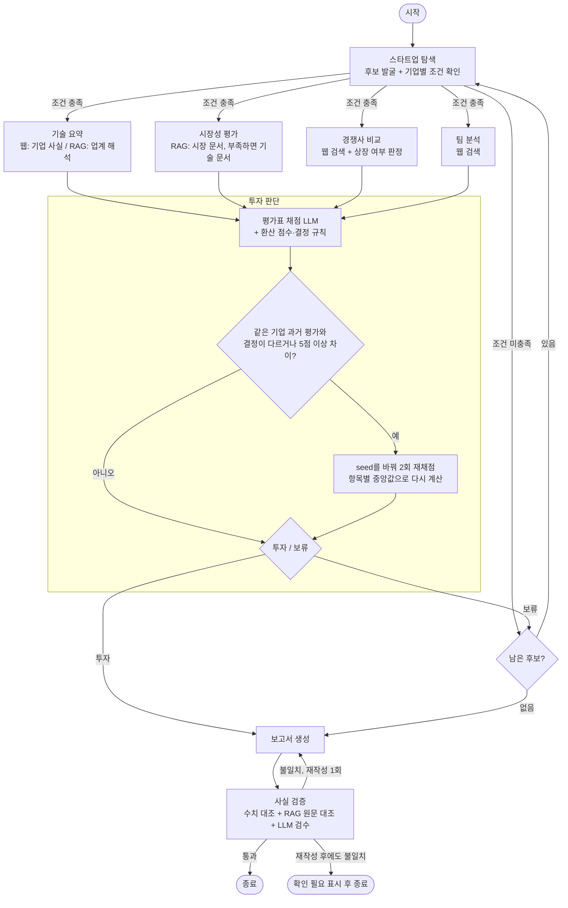

# AI Semiconductor Startup Investment Evaluation Agent

본 프로젝트는 국내 AI 반도체 스타트업에 대한 투자 가능성을 자동으로 평가하는 에이전트를 설계하고 구현한 실습 프로젝트입니다.

## Overview
- Objective : AI 반도체 스타트업의 기술·제품 성숙도, 시장성, 창업자·팀, 실적, 경쟁 우위, 투자조건을 기준으로 투자 적합성 분석
- Method : LangGraph Multi-Agent, Agentic RAG (Corrective RAG, Self-RAG)
- Tools : Tavily 웹 검색, Chroma 벡터 DB

## 차별점

| # | 차별점 | 어떻게 | 코드 |
|---|---|---|---|
| 1 | **LLM은 추출만, 판정은 코드** | LLM은 문서·기사에서 사실과 점수 근거를 뽑기만 한다. 조건 충족, 수치 원문 대조, 세부 분야 판정, 정보 부족 감점, 투자/보류 결정은 코드 규칙으로 한다. 같은 점수면 항상 같은 결정이 나온다 | `explorer.is_eligible`, `market.number_in_source`, `judge.apply_evidence_rules`, `judge.decide` |
| 2 | **출처를 AI가 만들 수 없는 보고서** | 점수표, 환산 점수, REFERENCE, 본문 [n] 번호는 코드가 State에서 만든다. 문장만 LLM이 쓴다 | `agents/reporter.py` |
| 3 | **3단계 사실 검증** | ① State 대조(값+단위, 코드) → ② RAG 원문 대조(Self-RAG: 관련성 검사, 검색어 재작성) → ③ LLM 검수. 불일치면 1회 재작성, 그래도 불일치면 "(확인 필요)" 표시 | `agents/verifier.py` |
| 4 | **문서 품질부터 보정** | KDB 보고서의 글꼴 손상 20쪽을 OCR로 다시 읽고, 값이 뒤섞이는 그래프 숫자는 적재에서 뺐다 | `rag/ocr_fix.py`, `rag/ingest.py` |
| 5 | **측정한 뒤 개선** | 임베딩 모델은 우리 문서로 비교해서 골랐다. 시장성 평가는 정답지를 만들어 전후를 쟀고, 효과가 없는 기법(Reranker)은 넣지 않았다 | `eval/embedding/`, `eval/market/` |

## Features
- 웹 검색 기반 평가 후보 발굴과 조건(비상장, Seed ~ Series C, Exit 전) 필터링
- 공공 연구기관 보고서(10편, 182쪽) 기반 기술·시장 분석 (RAG, 근거 부족 시 재검색)
- 평가표 기반 채점과 규칙 기반 투자/보류 결정, 보류 시 다음 후보로 반복
- 출처가 붙은 투자 보고서(마크다운, 제출용 PDF) 생성과 수치 사실 검증

## Tech Stack
- Framework : LangGraph
- LLM/Generator : gpt-4.1-mini (temperature 0)
- LLM/Judge : gpt-4.1 (생성 모델과 다른 모델)
- Retrieval : Chroma - Hit Rate@3 0.96, Hit Rate@5 0.98, MRR@5 0.837 (임베딩 선정 실험)
- Embedding : nlpai-lab/KURE-v1 (오픈소스, 후보 3종 비교 실험으로 선정)

## Agents
| 에이전트 | 도구 | LLM이 하는 일 | 코드가 하는 일 |
|---|---|---|---|
| 스타트업 탐색 | 웹 | 검색 결과에서 기업 정보 추출 | 상장 여부·투자 단계·Exit 조건 판정, 세부 분야 분류 |
| 기술 요약 | 웹 + RAG(tech) | 기업 사실(칩·공정·개발 단계·실적) 추출, 보고서 기준으로 해석 | 관련성·근거 일치 검사(Self-RAG), 부족한 항목만 재검색 |
| 시장성 평가 | RAG(market → tech) | 시장 규모·성장률·수요 요인 추출 | 수치 원문 대조, 단위 검증, 세부 분야 판정. 세부 분야 수치가 없으면 tech 문서 재검색(Corrective RAG) |
| 경쟁사 비교 | 웹 | 경쟁사·차별점 정리, 구분 판정 결과를 받아 비교 문장 다시 쓰기 | 같은 세부 분야만 비교, 선도 기업(대기업·상장사)/동급 기업(비상장) 구분 |
| 팀 분석 | 웹 | 창업자·핵심 인력 경력 정리 | - |
| 투자 판단 | - | 항목별 1~5점과 근거, 법률 리스크 | 정보 부족 감점, 환산 점수, 투자/보류 결정, 같은 기업 과거 평가와 크게 다르면 재채점(항목별 중앙값) |
| 보고서 생성 / 사실 검증 | RAG | 문장 작성, 원문 모순 검수 | 점수표·출처 생성, 수치 대조, 재작성 분기 |

## Architecture

**설계 그래프** (설계 문서 4.1, 노드 안 흐름 포함 · 그림: `assets/graph_design.png`)



| 구조 | 동작 |
|---|---|
| 조건 분기 1 (탐색 후) | 기업별 재검색으로 상장 여부·투자 단계를 다시 확인하고, 조건 미충족이면 분석 없이 다음 후보로 |
| 병렬 실행 | 기술 요약·시장성 평가·경쟁사 비교·팀 분석을 동시에 실행, 넷이 끝나면 투자 판단 |
| 노드 안 재검색 | 기술 요약: 비어 있는 항목만 검색어를 바꿔 한 번 더 검색 / 시장성: 세부 분야 수치가 없으면 기술 문서까지 검색 |
| 투자 판단 안 일관성 검증 | 같은 기업·같은 평가 버전의 과거 기록(`outputs/judge_log.jsonl`)과 결정이 다르거나 5점 이상 차이 나면 seed를 바꿔 2회 재채점, 항목별 중앙값 사용 |
| 조건 분기 2 (투자 판단 후) | 투자면 보고서 생성, 보류면 다음 후보로. 후보는 최대 5개라 반복은 최대 5회 |
| 조건 분기 3 (사실 검증 후) | 불일치면 1회 재작성, 그래도 불일치면 해당 표현에 "(확인 필요)" 표시 후 종료 |

**코드에서 생성한 그래프** (`graph.py`를 LangGraph `get_graph().draw_mermaid()`로 그린 것, 점선은 조건부 분기)


노드 이름: explorer(스타트업 탐색), tech_summary(기술 요약), market(시장성 평가), competitor(경쟁사 비교),
team(팀 분석), judge(투자 판단), reporter(보고서 생성), verifier(사실 검증).
explorer → explorer는 조건 미충족 시 다음 후보, explorer → reporter는 후보를 모두 평가한 경우다.

## 투자 판단 기준

| 항목 | 비중 | 1점 | 3점 | 5점 |
|---|---|---|---|---|
| 시장성 | 30% | 세부 분야 시장 수치 없음 | 연평균 성장률 10~20% | 수십억 달러 이상, 성장률 20% 이상 |
| 창업자·팀 | 25% | 창업자 정보 비공개 | 반도체 관련 경력·박사 | 교수·임원급 + 창업·매각 경험 또는 핵심 인력 공개 |
| 기술·제품 성숙도 | 20% | 설계·아키텍처 단계 | 테이프아웃 또는 엔지니어링 샘플 | 양산 제품을 복수 고객에 공급 |
| 실적·고객 검증 | 10% | 매출·고객 없음 | 초기 매출 또는 유상 PoC | 매출 100억 원 이상 또는 대형 공급 계약 |
| 경쟁 우위 | 10% | 차별점 불분명 | 성능·전력 효율의 수치 우위 | 수치 우위 + 특허 또는 자체 SW + 제3자 검증 |
| 투자조건 | 5% | 투자 정보 없음 | 라운드 금액과 투자사 공개 | 기업가치 공개 + 전략적 투자자 |

- 환산 점수 = Σ(항목 점수 ÷ 5 × 비중), **70점 이상이면 투자**
- 기술 비중은 설계 때 30%였다가 20%로 낮췄다. 평가 대상은 대부분 양산 전이라 기술 점수가 최대 3점에 머물기 때문이다
- 70점 이상이어도 보류: 핵심 항목(기술·팀) 1점 이하, 핵심 기술 관련 법률 리스크 미해소
- 공개 정보로 확인할 수 없거나 출처가 없는 항목은 최대 2점 (근거 없이 높은 점수 방지)
- 핵심 항목이 2점 이하이면 투자여도 보고서에 주의 코멘트를 남긴다

전체 기준표는 `agents/judge.py`의 `RUBRIC`, 가중치·임계값은 `config.py`에 있다.

## 평가·검증

### 1) Embedding 선정 실험

공개 리더보드 순위가 아니라 우리 문서 풀에서의 검색 성능으로 임베딩 모델을 골랐다. 코드: `eval/embedding/compare.py`

**방법**
- 문서 10편(182쪽)을 실제 파이프라인(`rag/ingest.py`)과 같은 방식으로 청크 450개로 분할 (tech 266, market 184)
- 문서 유형별로 청크 25개씩 무작위로 뽑아, gpt-4.1-mini가 그 청크로만 답할 수 있는 질문을 생성 → 평가 질문 50개 (`eval/embedding/qa_set.json`)
- 모델마다 청크와 질문을 임베딩하고, 설계대로 같은 문서 유형 안에서만 검색해 정답 청크의 순위를 측정

**결과** (`eval/embedding/results.json`)

| 모델 | Hit@1 | Hit@3 | Hit@5 | MRR@5 | 임베딩 시간 |
|---|---|---|---|---|---|
| BAAI/bge-m3 | 0.66 | 0.92 | 0.98 | 0.800 | 32.9초 |
| **nlpai-lab/KURE-v1** | 0.72 | **0.96** | **0.98** | **0.837** | **32.9초** |
| Qwen/Qwen3-Embedding-0.6B | **0.74** | 0.92 | 0.96 | 0.836 | 41.0초 |

**선정: KURE-v1**
- MRR@5는 Qwen3-Embedding과 거의 같고(0.837, 0.836), bge-m3보다 높다.
- 에이전트는 검색 결과 상위 4개를 참고하므로 1위 적중(Hit@1)보다 상위 3~5개 안에 드는지가 중요하다. Hit@3, Hit@5에서 KURE-v1이 가장 높다.
- 같은 문서를 임베딩하는 데 Qwen3-Embedding보다 약 20% 빠르다.

**한계**: 평가 질문이 50개라 모델 간 차이는 1~2문항 수준이다. 질문을 정답 청크에서 생성했기 때문에 표현이 겹쳐 Hit@5가 전반적으로 높게 나온다. 실험 이후 KDB 보고서의 글꼴 손상 쪽을 OCR로 보정하고 그래프 숫자를 빼서(`data/README.md`) 현재 적재 청크는 429개다.

### 2) 시장성 평가 개선

세부 분야 5개(데이터센터·엣지·차량용·인프라·기타)마다 문서에 실제로 있는 시장 수치를 정답지로 만들고(`eval/market/gold.json`), 실제 `market_node`를 돌려 뽑은 수치와 비교했다.

| 지표 | 의미 | 개선 전 | 개선 후 |
|---|---|---|---|
| 충분성 | 세부 분야 시장 규모·성장률을 모두 확보한 비율 | 0.8 | **1.0** |
| 재현율 | 반드시 뽑아야 하는 대표 수치 중 뽑은 비율 | 0.6 | **0.95** |
| 정밀도 | 대상 분야 수치로 뽑은 것 중 정답 비율 | 0.833 | **1.0** |

- **발견:** 정답 청크는 이미 모두 LLM에 전달되고 있었다(도달률 1.0). 병목은 검색이 아니라 **추출**이었다.
- **수정:** ① 프롬프트의 분야명 "기타"를 "AI 반도체 전체"로 (차트 범례 "기타"와 혼동) ② 단위 없는 값 제거 (차트 눈금값 "155", "524"가 채택되던 문제) ③ "데이터센터용 AI반도체"가 전체 시장 수치로 인정되던 판정 수정 ④ 그래프 숫자 제외 후 재적재
- **적용하지 않은 것:** Reranker(bge-reranker-v2-m3)로 검색 지표는 올랐지만(hit@4 0.524→0.619, MRR 0.394→0.512) 추출 결과는 같고 실행 시간이 2배 이상 늘었다.
- **한계:** 분야당 기업 1개, 2회 평균. 정답지는 팀이 원문을 보고 확정했다.

재현: `uv run python -m eval.market.evaluate --label <이름> --runs 2` (결과: `eval/market/results/summary.md`)

## Directory Structure
```
├── data/             # RAG 문서 풀 (tech/, market/), ocr/ (KDB 글꼴 손상 쪽 OCR 텍스트)
├── agents/           # 에이전트 모듈 (에이전트별 파일, 프롬프트 포함), web.py (공용 웹 검색)
├── rag/              # 문서 적재(ingest), 임베딩, 검색기, OCR 보정
├── eval/
│   ├── embedding/    # 임베딩 후보 비교 실험 (스크립트, 평가 질문, 결과)
│   └── market/       # 시장성 평가 정답지, 평가 스크립트, 결과
├── tests/            # 단위 테스트 (API 키 없이 실행)
├── assets/           # README 그림
├── outputs/          # 생성된 보고서 (마크다운, PDF), 채점 로그
├── state.py          # 공용 State 정의
├── graph.py          # LangGraph 흐름
├── config.py         # 모델·가중치·임계값 설정
├── app.py            # 실행 스크립트
└── README.md
```

## Usage
```bash
uv sync                           # uv가 없으면: pip install -r requirements.txt
touch .env                        # 아래 키를 넣는다 (.env·.env.*는 git에 올리지 않음)
uv run python -m rag.ingest       # 최초 1회: 문서 임베딩 → vectorstore/ (청크 429개)
uv run python app.py              # 보고서 생성 → outputs/report_*.md, 제출용 PDF

uv run --with pytest python -m pytest tests -q   # 테스트 (API 키 불필요)
```

`.env`에 넣을 값 (이름만, 값은 각자 발급):

| 변수 | 용도 |
|---|---|
| `OPENAI_API_KEY` | 분석·판단·보고서 LLM (gpt-4.1-mini, gpt-4.1) |
| `TAVILY_API_KEY` | 웹 검색 |
| `HF_TOKEN` | KURE-v1 임베딩 모델 다운로드 |
| `LANGSMITH_API_KEY`, `LANGSMITH_TRACING=true`, `LANGSMITH_PROJECT` | 실행 추적 (선택) |

## 투자 보고서 핵심 포인트

최종 보고서: `RAG-Output_울산캠퍼스-4반_강지수+김다은+이진우+이채목+장정훈.pdf` (4쪽)

**결론: 엑시나(인프라·CXL 메모리, Series B) 투자, 환산 점수 78.0점**
- 후보 5개(엑시나, 모빌린트, 디노티시아, 아티크론, 보스반도체) 중 첫 번째로 평가한 엑시나가 기준을 넘어 보고서를 생성했다

| 항목 | 점수 | 근거 |
|---|---|---|
| 시장성 (30%) | 5 | CXL 메모리 2023년 14백만달러 → 2026년 3,400백만달러, HBM 2024년 170억 → 2030년 980억 달러(연평균 33%), HBF 2030년 120억 달러 |
| 창업자·팀 (25%) | 5 | SK하이닉스 최연소 임원(SSD Firmware 부사장) 출신 대표, CTO·CPO까지 공개 |
| 기술·제품 성숙도 (20%) | 2 | 삼성전자 4나노 공정 CXL 3.0 프로토타입 개발 중. 테이프아웃·엔지니어링 샘플 근거 없음 |
| 실적·고객 검증 (10%) | 2 | 빅테크·하이퍼스케일러와 무상 PoC·MOU. 유상 계약·매출 미확인 |
| 경쟁 우위 (10%) | 3 | PCIe 6.0·CXL 3.2, RISC-V 코어 내장, SDK(XFLARE) 풀스택. 성능 수치 우위 근거 부족 |
| 투자조건 (5%) | 5 | 시리즈 B 약 2,000억 원, 기업가치 약 8,600억 원, 전략적 투자자 참여 |

- **핵심 리스크:** 기술 성숙도가 낮다(양산 전, 매출 전). 삼성전자·SK하이닉스·파두 같은 선도 기업과 파네시아 같은 동급 스타트업과의 경쟁이 심해지고, HBM 수율·공급 부족 같은 시장 리스크도 있다.
- **규칙이 드러난 부분:** 기술 2점은 보류 조건(1점 이하)에 해당하지 않지만, 보고서에 "⚠ 주의" 코멘트로 남았다. 법률 리스크는 "해당 없음"이다.
- **자동 검증:** 본문 수치 40/40 일치, 인용 15건 연결, 핵심 주장 4/4 근거 확인. RAG 원문 대조 6건 중 1건 불일치는 LLM이 "3,400백만달러"를 "34억 달러"로 환산해 쓴 표기다. 값은 같지만 원문에 없는 표기라서 검증기가 "(확인 필요)"로 표시했다.

## Lessons Learned

- **가정하지 말고 먼저 재야 한다.** 시장성 평가는 검색이 약점이라고 보고 Reranker 등을 계획했지만, 정답지로 재 보니 병목은 추출이었다. Reranker는 검색 지표만 올리고 결과는 바꾸지 못했다.
- **LLM 판단은 흔들린다. 판정은 코드로.** temperature 0이어도 같은 입력의 응답이 달라 점수가 흔들렸다. LLM에는 추출만 맡기고 조건·결정은 규칙으로 옮겼다. 분석 에이전트에는 seed 고정과 재시도도 넣었다.
- **어떤 오답은 데이터에서만 고칠 수 있다.** 차트 눈금값에 LLM이 단위를 붙인 오답은 프롬프트와 코드 규칙으로 거르지 못했다. 규칙을 세게 걸면 정답도 함께 떨어졌다. 적재 단계에서 그래프 숫자를 빼자 사라졌다.
- **리스크를 "적는 것"과 "판단에 반영하는 것"은 다르다.** 보고서 리스크 목록에는 적힌 법률 리스크가 보류 조건으로는 이어지지 않은 사례가 있었다. 판정 로그를 남겨 원인을 추적할 수 있게 했다.
- **공용 모듈은 팀 전체의 입출력 계약이다.** 병렬 노드가 임베딩 모델과 벡터 DB에 동시에 접근하면서 크래시가 났다. `rag/` 변경은 다른 에이전트에 주는 영향부터 확인했다.

## Contributors
- 강지수 : 시장성 평가 에이전트, 시장성 평가 정답지·개선 실험
- 김다은 : 투자 판단 에이전트
- 이진우 : 보고서 생성, 사실 검증
- 이채목 : 스타트업 탐색, 경쟁사 비교, 팀 분석 에이전트, RAG 공통 기반, 그래프 연결
- 장정훈 : 기술 요약 에이전트
