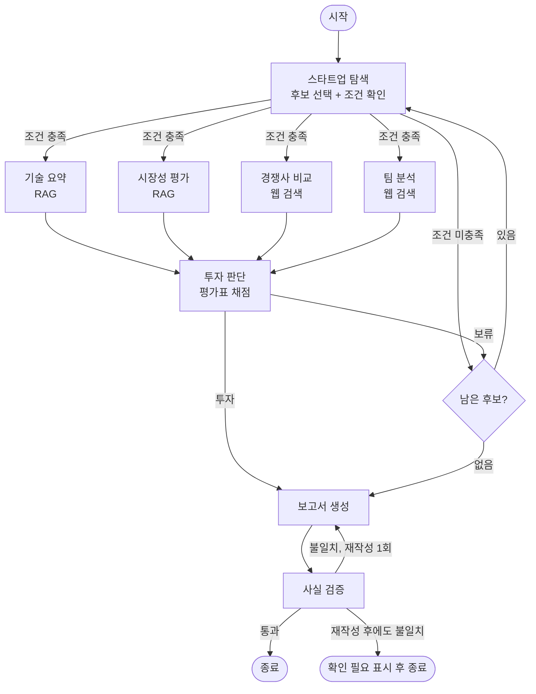
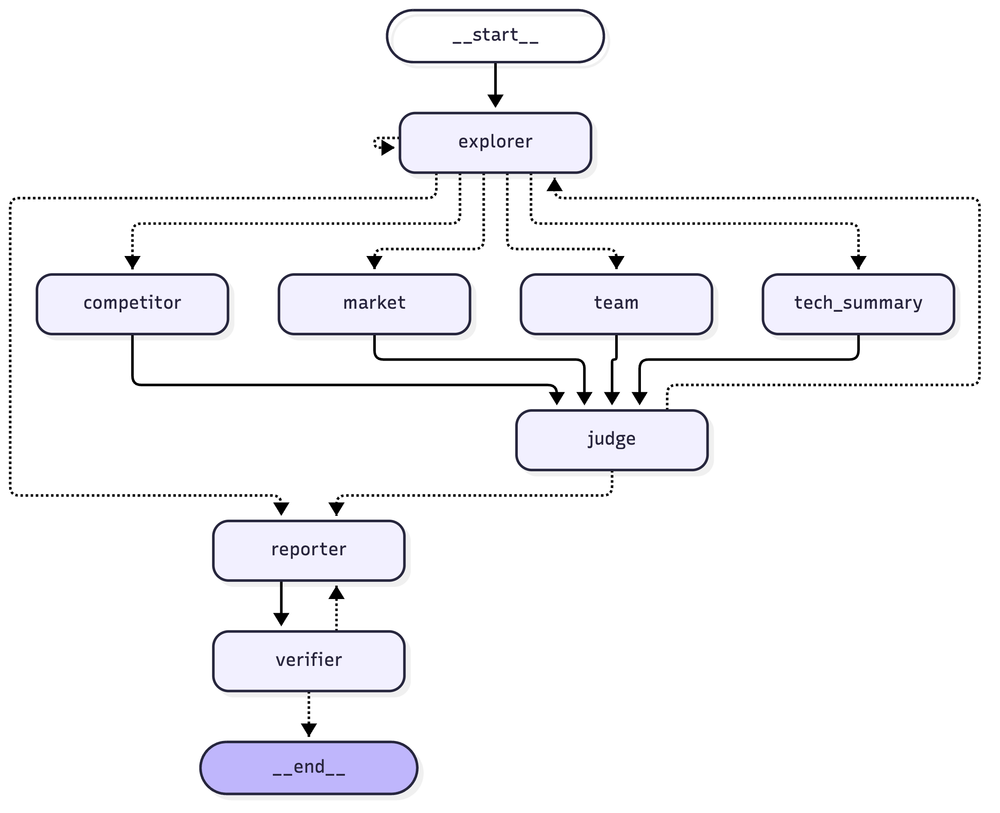

# AI Semiconductor Startup Investment Evaluation Agent

본 프로젝트는 국내 AI 반도체 스타트업에 대한 투자 가능성을 자동으로 평가하는 에이전트를 설계하고 구현한 실습 프로젝트입니다.

## Overview
- Objective : AI 반도체 스타트업의 기술·제품 성숙도, 시장성, 창업자·팀, 실적, 경쟁 우위, 투자조건을 기준으로 투자 적합성 분석
- Method : LangGraph Multi-Agent, Agentic RAG
- Tools : Tavily 웹 검색, Chroma 벡터 DB

## Features
- 웹 검색 기반 평가 후보 발굴과 조건(비상장, Seed ~ Series C, Exit 전) 필터링
- 공공 연구기관 보고서(10편, 182쪽) 기반 기술·시장 분석 (RAG, 근거 부족 시 재검색)
- 평가표 기반 채점과 규칙 기반 투자/보류 결정, 보류 시 다음 후보로 반복
- 출처가 붙은 투자 보고서 생성과 수치 사실 검증

## Tech Stack
- Framework : LangGraph
- LLM/Generator : gpt-4.1-mini
- LLM/Judge : gpt-4.1
- Retrieval : Chroma - Hit Rate@3 0.96, Hit Rate@5 0.98, MRR@5 0.837
- Embedding : nlpai-lab/KURE-v1 (오픈소스, 후보 3종 비교 실험으로 선정)

## Agents
- 스타트업 탐색 : 웹 검색으로 후보 발굴(1차 판정) 후 기업별 재검색으로 조건 상세 확인, 세부 분야 분류
- 기술 요약 : RAG(기술 문서)로 칩·공정·개발 단계·강점·약점 요약
- 시장성 평가 : RAG(시장 보고서)로 세부 분야 시장 규모·성장률·수요 요인 분석. 세부 분야 수치가 없으면 기술 보고서까지 재검색
- 경쟁사 비교 : 웹 검색으로 경쟁사 목록과 차별점, 경쟁 리스크 정리. 경쟁사의 세부 분야를 별도로 판정해 같은 분야만 비교
- 팀 분석 : 웹 검색으로 창업자·핵심 인력 역량 분석
- 투자 판단 : 평가표 채점(LLM) 후 환산 점수·투자 결정(규칙)
- 보고서 생성 / 사실 검증 : 보고서 작성, 수치와 출처 대조

## Embedding 선정 실험

공개 리더보드 순위가 아니라 우리 문서 풀에서의 검색 성능으로 임베딩 모델을 골랐다. 코드: `eval/embedding/compare.py`

**방법**
- 문서 10편(182쪽)을 실제 파이프라인(`rag/ingest.py`)과 같은 방식으로 청크 450개로 분할 (tech 266, market 184)
- 문서 유형별로 청크 25개씩 무작위로 뽑아, gpt-4.1-mini가 그 청크로만 답할 수 있는 질문을 생성 → 평가 질문 50개 (`eval/embedding/qa_set.json`)
- 모델마다 청크와 질문을 임베딩하고, 설계대로 같은 문서 유형 안에서만 검색해 정답 청크의 순위를 측정

**결과** (`eval/embedding/results.json`)

| 모델 | Hit@1 | Hit@3 | Hit@5 | MRR@5 | 임베딩 시간 |
|---|---|---|---|---|---|
| BAAI/bge-m3 | 0.66 | 0.92 | 0.98 | 0.800 | 32.9초 |
| **nlpai-lab/KURE-v1** | 0.72 | **0.96** | **0.98** | **0.837** | **32.9초** |
| Qwen/Qwen3-Embedding-0.6B | **0.74** | 0.92 | 0.96 | 0.836 | 41.0초 |

**선정: KURE-v1**
- MRR@5는 Qwen3-Embedding과 거의 같고(0.837, 0.836), bge-m3보다 높다.
- 에이전트는 검색 결과 상위 4개를 참고하므로 1위 적중(Hit@1)보다 상위 3~5개 안에 드는지가 중요하다. Hit@3, Hit@5에서 KURE-v1이 가장 높다.
- 같은 문서를 임베딩하는 데 Qwen3-Embedding보다 약 20% 빠르다.

**한계**: 평가 질문이 50개라 모델 간 차이는 1~2문항 수준이다. 질문을 정답 청크에서 생성했기 때문에 표현이 겹쳐 Hit@5가 전반적으로 높게 나온다. 실험 이후 KDB 보고서의 글꼴 손상 쪽을 OCR로 보정해(`data/README.md`) 현재 적재 청크는 430개다.

## Architecture

**설계 그래프** (설계 문서 4.1)



| 구조 | 동작 |
|---|---|
| 조건 분기 1 (탐색 후) | 기업별 재검색으로 상장 여부·투자 단계를 다시 확인하고, 조건 미충족이면 분석 없이 다음 후보로 |
| 병렬 실행 | 기술 요약·시장성 평가·경쟁사 비교·팀 분석을 동시에 실행, 넷이 끝나면 투자 판단 |
| 조건 분기 2 (투자 판단 후) | 투자면 보고서 생성, 보류면 다음 후보로. 후보는 최대 5개라 반복은 최대 5회 |
| 조건 분기 3 (사실 검증 후) | 불일치면 1회 재작성, 그래도 불일치면 해당 표현에 "(확인 필요)" 표시 후 종료 |

**코드에서 생성한 그래프** (`graph.py`를 LangGraph `get_graph().draw_mermaid()`로 그린 것, 점선은 조건부 분기)



노드 이름: explorer(스타트업 탐색), tech_summary(기술 요약), market(시장성 평가), competitor(경쟁사 비교),
team(팀 분석), judge(투자 판단), reporter(보고서 생성), verifier(사실 검증).
explorer → explorer는 조건 미충족 시 다음 후보, explorer → reporter는 후보를 모두 평가한 경우다.

## Directory Structure
```
├── data/            # RAG 문서 풀 (tech/, market/)
├── agents/          # 에이전트 모듈 (에이전트별 파일)
├── rag/             # 문서 적재(ingest), 임베딩, 검색기
├── prompts/         # 프롬프트 템플릿
├── eval/embedding/  # 임베딩 후보 비교 실험 (스크립트, 평가 질문, 결과)
├── assets/          # README 그림
├── outputs/         # 생성된 보고서
├── state.py         # 공용 State 정의
├── graph.py         # LangGraph 흐름
├── config.py        # 모델·가중치·임계값 설정
├── app.py           # 실행 스크립트
└── README.md
```

## Usage
```bash
uv sync                           # uv가 없으면: pip install -r requirements.txt
cp .env.example .env              # 키 입력
uv run python -m rag.ingest       # 최초 1회: 문서 임베딩 → vectorstore/
uv run python app.py
```

## Contributors
- 강지수 : 시장성 평가 에이전트
- 김다은 : 투자 판단 에이전트
- 이진우 : 보고서 생성, 사실 검증
- 이채목 : 스타트업 탐색, 경쟁사 비교, 팀 분석 에이전트, RAG 공통 기반, 그래프 연결
- 장정훈 : 기술 요약 에이전트
